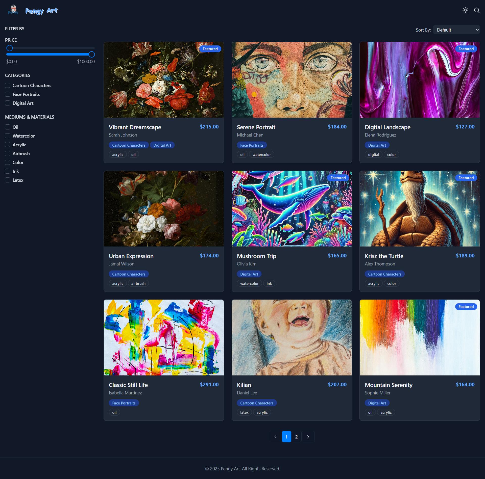

# Pengy Art Gallery

Welcome to the Pengy Art Gallery! This is an interactive art gallery web app where you can explore various art pieces, filter and sort them based on different categories, and enjoy the curated collection.

## Features

- **Filter**: Filter artworks by different categories (e.g., type, artist, style).
- **Sort**: Sort the artworks by popularity, date, or other criteria.
- **Responsive**: The gallery is designed to work on both desktop and mobile devices.

  ## Demo


## Technologies Used

- **Frontend**:
  - **React**: For building the user interface.
  - **Tailwind CSS**: For utility-first CSS styling.
  - **Framer Motion**: For animations and transitions.
  - **React Query**: For data fetching and state management.
  - **Recharts**: For visualizing data (e.g., charts).
  - **Lucide-React**: For adding icons.

- **Backend**:
  - **Express**: A web framework for Node.js, used for building the server and handling routes.
  - **Passport**: For user authentication.
  - **Drizzle ORM**: An ORM for managing database interactions.
  - **Connect-PG-Simple**: For handling session storage in PostgreSQL.

- **Database**:
  - **PostgreSQL**: A relational database for storing data, integrated via **Drizzle ORM** and **connect-pg-simple** for sessions.

- **DevOps/Build Tools**:
  - **Vite**: A fast build tool and development server for React applications.
  - **ESBuild**: For bundling server-side code during the build process.
  - **TypeScript**: For static type checking and improved developer experience.
  - **Cross-env**: For setting environment variables across different platforms.

- **Authentication**:
  - **Passport Local**: For handling local user authentication (username and password).

- **Other Tools**:
  - **Zod**: For schema validation.
  - **Drizzle-Kit**: For database migrations and schema management.
  - **Lucide Icons**: A collection of customizable icons for the UI.


## Installation

To get started with this project locally, follow these steps:

1. Clone the repository:
   ```bash
   git clone https://github.com/Moaz-Elbeshbeshy/Pengy-Art.git


 
